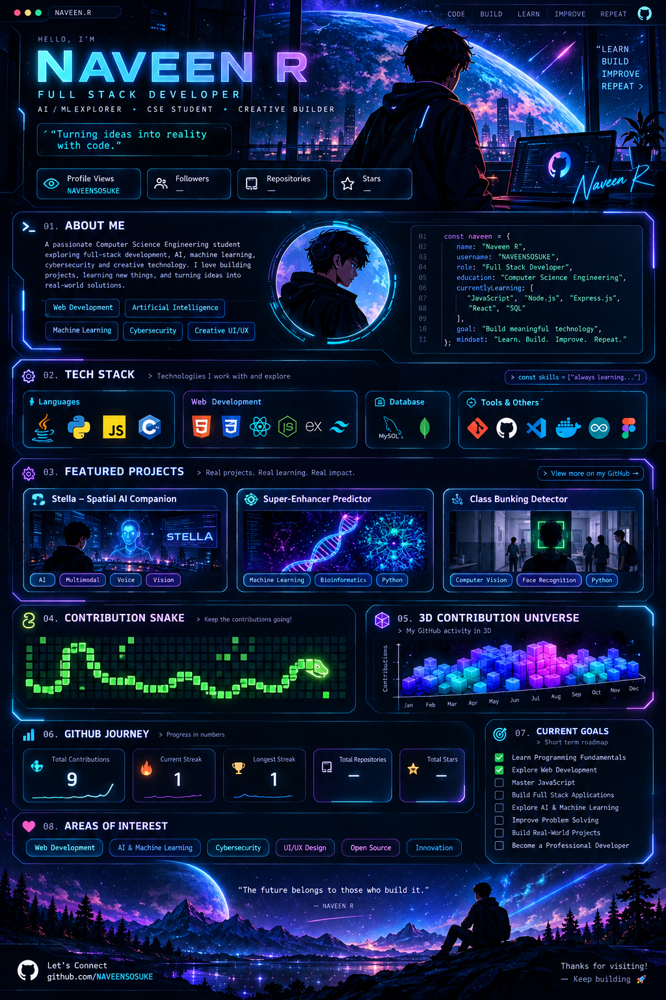

<div align="center">



</div>
<div align="center">


<br/>


<a href="https://github.com/NAVEENSOSUKE?tab=followers">

</a>

</div>

---

<div align="center">

## 🌌 WELCOME TO MY DIGITAL UNIVERSE

```text
╔══════════════════════════════════════════════╗
║              NAVEEN R // SYSTEM              ║
╠══════════════════════════════════════════════╣
║ STATUS       : LEARNING & BUILDING            ║
║ ROLE         : FULL STACK DEVELOPER           ║
║ FOCUS        : AI • WEB • CYBERSECURITY       ║
║ MISSION      : TURN IDEAS INTO REALITY        ║
╚══════════════════════════════════════════════╝
```

</div>

---

## 👨‍💻 About Me

```javascript
const naveen = {
    name: "Naveen R",
    username: "NAVEENSOSUKE",
    role: "Full Stack Developer in Progress",

    education: "Computer Science Engineering",

    interests: [
        "Web Development",
        "Artificial Intelligence",
        "Machine Learning",
        "Cybersecurity",
        "Creative UI/UX"
    ],

    currentlyLearning: [
        "JavaScript",
        "Node.js",
        "Express.js",
        "React",
        "SQL"
    ],

    projects: [
        "Stella AI Companion",
        "Super-Enhancer Predictor",
        "Class Bunking Detector"
    ],

    mindset: "Learn. Build. Improve. Repeat."
};
```

> 🚀 Computer Science Engineering student exploring full-stack development, AI, and creative technology.

---

## ⚡ Developer Dashboard

<div align="center">

<table>
<tr>
<td align="center" width="250">

### 💻 FRONTEND

HTML  
CSS  
JavaScript  
React

</td>

<td align="center" width="250">

### ⚙️ BACKEND

Node.js  
Express.js  
REST APIs  
SQL

</td>

<td align="center" width="250">

### 🧠 AI / ML

Python  
Machine Learning  
Computer Vision  
Data Science

</td>
</tr>
</table>

</div>

---

## 🛠️ Tech Stack

<div align="center">

### Languages


### Web Development


### Tools & Technologies


</div>

---

## 🚀 Featured Projects

<div align="center">

### 🌌 STELLA — Spatial AI Companion


</div>

A futuristic AI companion exploring voice, vision, spatial understanding, and interactive user interfaces.

**Focus:**
- 🎙️ Voice interaction
- 👁️ Computer vision
- 🧠 Spatial intent
- 🎨 Modern glassmorphism UI

---

<div align="center">

### 🧬 SUPER-ENHANCER PREDICTOR


</div>

A bioinformatics and machine learning project exploring enhancer prediction and biological feature analysis.

**Focus:**
- 🧬 Genomic data
- 🤖 Machine learning
- 📊 Biological feature engineering
- 🔬 Scientific experimentation

---

<div align="center">

### 📸 CLASS BUNKING DETECTOR


</div>

An attendance-monitoring project exploring computer vision and face recognition.

**Focus:**
- 📷 Computer vision
- 🧠 Face recognition
- 🏫 Attendance monitoring

---

## 🐍 Contribution Snake

<div align="center">


</div>

---

## 🧊 3D Contribution Universe

<div align="center">


</div>

---

## 📊 GitHub Journey

<div align="center">

<a href="https://github.com/NAVEENSOSUKE">


</a>

</div>

---

## 🔥 Contribution Streak

<div align="center">


</div>

---

## 🎯 Current Goals

```text
[✓] Learn Programming Fundamentals
[✓] Explore Web Development
[→] Master JavaScript
[→] Build Full Stack Applications
[→] Explore AI & Machine Learning
[→] Improve Problem Solving
[→] Build Real-World Projects
[→] Become a Professional Developer
```

---

## 🔐 Areas of Interest

<div align="center">


</div>

---

## 🌌 Developer Philosophy

<div align="center">

### "Learn. Build. Improve. Repeat."

<br/>

💻 Code with purpose  
🧠 Learn continuously  
🚀 Build fearlessly  
🔥 Never stop improving  

</div>

---

## 📫 Connect With Me

<div align="center">

<a href="https://github.com/NAVEENSOSUKE">


</a>

</div>

---

<div align="center">


</div>
